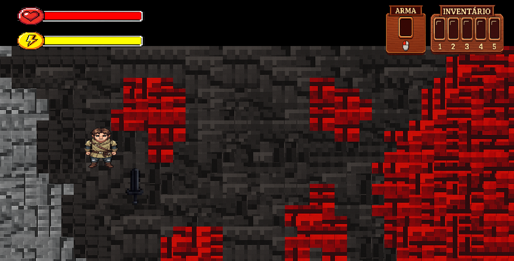
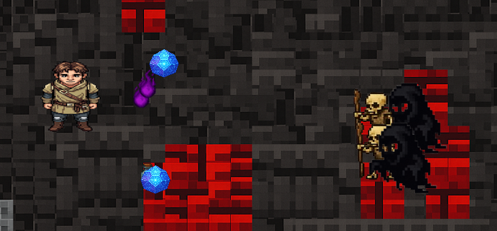
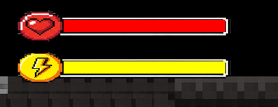

# alzareth-the-fall-of-asteria

### Jogo feito em C++ com SDL2 para as aulas de desenvolvimento de jogos digitais da UFMG 2025/01.

### Título: 

Alzareth - The Fall of Asteria

### Descrição: 

Jogo de ação e aventura em 2D em que o jogador controla um personagem que caiu em uma ilha deserta e precisa sobreviver enfrentando inimigos. O jogador pode coletar poções que melhoram seu desempenho além de armas que serão úteis para atacar os inimigos que correm em direção ao personagem. Além de sobreviver, o jogador deve prosseguir no mapa derrotando os inimigos para avançar no jogo.

### Prints:

Menu principal:

Tela principal e inventário:

!

Itens e armas:

Indicadores de energia e vida:

Menu de Pausa:

Tela de Derrota:

Tela de Vitória:

### Como jogar:

- W, A, S, D para mover
- Clique esquerdo para atacar
- CTRL para correr
- ESPAÇO para correr
- C para pegar itens
- 1, 2, 3, 4 e 5 para usar itens
- ESC para pausar

- E divirta-se! :)

### Funcionalidades implementadas que devem ser observadas:

- [x] Jogador se movimentando
- [x] Inimigos surgindo e se movimentando
- [x] Jogador atacando
- [x] Jogador sofrendo dano
- [x] Jogador pegando itens e armas
- [x] Jogador usando itens
- [x] Inventário do jogador
- [x] Barra de saúde e energia do jogador
- [x] Regeneração de energia do jogador com o tempo
- [x] Itens (poções) alterando status do jogador
- [x] Espada se movimentando com o clique do mouse
- [x] Inimigos sofrendo dano
- [x] Inimigos derrubando itens ao morrer
- [x] Inimigos atacando
- [x] Jogador correndo e usando dash
- [x] Sistema de Menu e de Pausa
- [x] Jogador pode morrer

### Tarefas pendentes:

- [ ] Corrigir colisões
- [ ] Mais inimigos
- [ ] Atualizar mapa
- [ ] Novos níveis
- [ ] Novas armas
- [ ] Chefe
- [ ] Atualizar animações
- [ ] Sprites do jogador
- [ ] Balanceamento da jogabilidade
- [ ] Corrigir bugs
- [ ] Pegar a arma usando C
- [ ] Música
- [ ] Objetivo

### Créditos:

- Francisco - Implementação do golem, espada, ataque e definição dos elementos visuais
- Gabriel - Implementação dos itens e sua lógica de utilização e coleta, além do inventário.
- Pedro - Implementação de movimentação do jogador, menu, câmera, sistema de pausa e critérios de finalização do jogo.